# gcc/c++链接极简实践
## 1.1	背景
常有同事被链接问题困扰，大部分是一些较常见的问题。链接这种问题，部分同事不太重视。这里做一些总结，相信可以解决这些同学80%的问题。
## 1.2	基础知识
### 1.2.1	链接参数
- -L  
	-L用于增加链接库的查找目录
- -I  
	-l 用于指定库文件，-lx表示链接libx.so或者libx.a
- -static  
	使用静态库。使用了该参数，没有静态库，即便是有动态库也不会使用动态库
- -fPIC  
	64位下编译静态库要用到
- -Wl,-Bstatic和-Wl,-Bdynamic  
	-Wl,-Bstatic参数后的链接库使用静态链接；  
	-Wl,-Bdynamic参数后的链接库使用动态链接；  
	两者合用就可以实现同时使用动态库和静态库。如果使用了-Wl,-Bstatic，那么其后面必须后-Wl,-Bdynamic，否则系统库可能会链接不了而报错。

### 1.2.2	默认搜索库路径  
gcc默认搜索/lib，/usr/lib下的库，也有系统也会默认搜索/usr/local/lib下面的库
### 1.2.3	动态库优先于静态库
如果有同名的静态库和静态库（后缀前的都相同，如libx.so和libx.a是同名的），那么会链接动态库。可以使用-static、-Wl,-Bstatic和-Wl,-Bdynamic来改变。
### 1.2.4	被依赖的库放在后面
如果链接的库之间有依赖关系，那么被依赖的静态库要放在依赖它的库后面。例如libb.so或者libb.a依赖liba.a，那么liba.a要放在libb.so或者libb.a后面。
## 1.3	工具
### 1.3.1	nm
列出文件中的符号。用nm可以看出定义的和未定义的符号。  

### 1.3.2	ldd
显示共享库(含可执行文件)的依赖情况。通过ldd可以知道共享库依赖哪些文件  
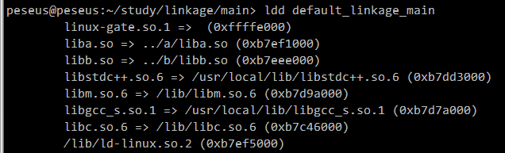
## 1.4	实践
用极简的例子实践，可以更快速和深入理解这些基础的知识，更好的掌握工具的使用。
### 1.4.1	练习程序如下：
依赖关系：  
main => b => a  
main/b/a与c没有任何依赖关系  
main/makefile定义了很多例子，用来联系上面提到的基础知识  
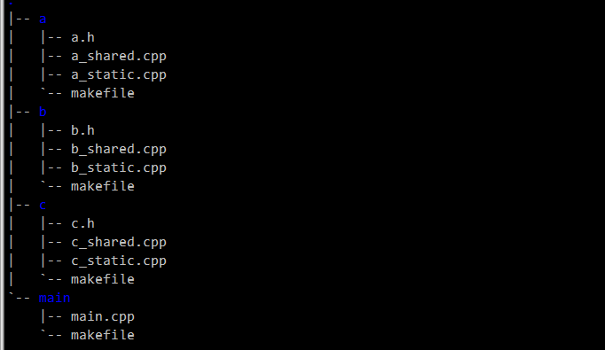
### 1.4.2	被依赖的库要放在依赖它的库后面
目标positon_error_linkage_main把liba.a写在前面，将导致无法链接  
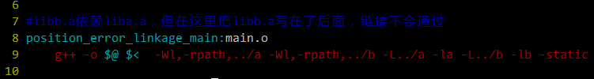  
make positon_error_linkage_main运行结果：  
  
目标static_linkage_main和目标positon_error_linkage_main的区别在于liba.a和libb.a的顺序调转  
  
make static_linkage_main：  
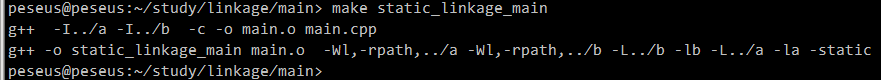  
./static_linkage_main运行结果：  
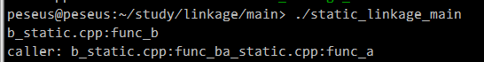  
### 1.4.3	动态库优先于静态库链接  
目标default_linkage_main依赖库文件a和库文件b。a目录和b目录同时存在动态库和静态库。  
  
make default_linkage_main：  
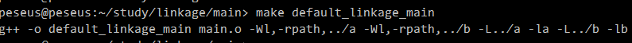  
查看default_linkage_main的依赖关系：  
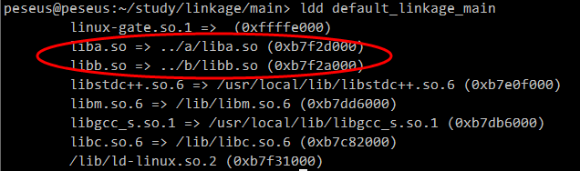  
说明链接的是动态库  
### 1.4.4	使用静态链接  
目标static_linkage_main使用静态链接。使用静态链接后，即便是存在动态库，但不存在动态库，也会链接不上  
删除liba.so和libb.so，然后：  
make static_linkage_main：  
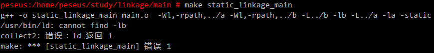  
### 1.4.5	混用静态链接和动态链接  
目标mix_linkage_main混用动态链接和静态链接，会链接静态库liba.a和动态库libb.so  
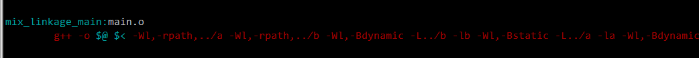  
运行make mix_linkage_main  
查看mix_linkage_main的依赖关系  
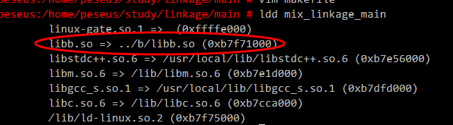  
说明只动态链接了b库，而a库是静态链接的  
### 1.4.6	使用nm查看未定义的函数
库b依赖库a的func_a函数，通过nm可以看出来libb.a和libb.so中有一个未定义的符号func_a：  
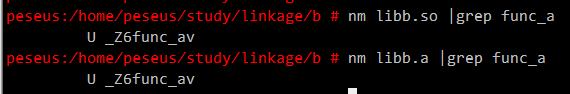  
### 1.4.7	其他
main/makefile中还定义了其他的目标供自行练习
### 1.4.8 附件
附件是[练习例子](../download/linkage.20140623.tar.gz)，下载后可以自行实践。